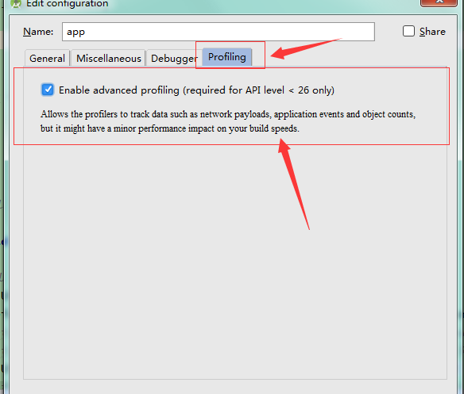

## 报错信息

```java
java.lang.UnsatisfiedLinkError: dlopen failed: "/data/app-lib/com.bjgoodwill.waiterphone-2/libsupportjni.so" has unexpected e_machine: 40
java.lang.Runtime.loadLibrary(Runtime.java:364)
java.lang.System.loadLibrary(System.java:526)
com.android.tools.profiler.support.ProfilerService.<clinit>(ProfilerService.java:41)
android.support.multidex.MultiDexApplication.<init>(MultiDexApplication.java:35)
com.bjgoodwill.waiterphone.MyApplication.<init>(MyApplication.java:8)
java.lang.Class.newInstanceImpl(Native Method)
java.lang.Class.newInstance(Class.java:1208)
android.app.Instrumentation.newApplication(Instrumentation.java:1007)
android.app.Instrumentation.newApplication(Instrumentation.java:992)
android.app.LoadedApk.makeApplication(LoadedApk.java:511)
android.app.ActivityThread.handleBindApplication(ActivityThread.java:4319)
android.app.ActivityThread.access$1500(ActivityThread.java:135)
android.app.ActivityThread$H.handleMessage(ActivityThread.java:1256)
android.os.Handler.dispatchMessage(Handler.java:102)
android.os.Looper.loop(Looper.java:136)
android.app.ActivityThread.main(ActivityThread.java:5019)
java.lang.reflect.Method.invokeNative(Native Method)
java.lang.reflect.Method.invoke(Method.java:515)
com.android.internal.os.ZygoteInit$MethodAndArgsCaller.run(ZygoteInit.java:779)
com.android.internal.os.ZygoteInit.main(ZygoteInit.java:595)
dalvik.system.NativeStart.main(Native Method)
```
## 解决方法
   Run -> Edit Configurations -> Profiling  中   这个选项的勾勾去掉

