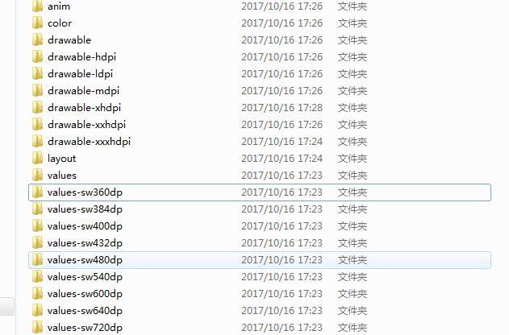
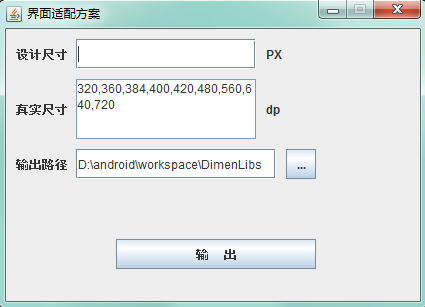

## 一、背景
Android碎片化问题是让所有的Android开发者都比较头疼的问题.尤其是屏幕适配这一块儿.想要自己的app在不同的设备上面都有一个相同的显示效果.就必须做好屏幕的适配工作.下面介绍一下我们在项目中用到的屏幕适配方案。

**本适配方案的目标是：完全按照设计图上标注的尺寸来编写页面。**

## 二、先看一下我们的适配文件
我们是利用屏幕像素密度（dp）来适配的，这样的好处是虽然手机屏幕的尺寸是千奇百怪，但是屏幕的像素密度还是相对来说是比较有限的，所以我们使用多个dimens文件来对应响应的屏幕
- 再看一下适配文件

<!--more-->
SW全称是Smallest Width，表示最小宽度，例如当你屏幕的绝对宽度大于等于400dp的时候，系统会多用的的values-sw400dp下的dimens文件，我们可以使用一下代码获取sw值
```java
//获取屏幕最小宽度dp
getResources().getConfiguration().smallestScreenWidthDp
```
- 再看一下dimens里面的文件

解释一下
**750-85dp**  中750为设计图尺寸，85为设计图中所占的尺寸，也就是如果一个控件因为的宽度是750-85dp，那么说明这个控件在750的设计图中所占的尺寸是85像素。
在这里首先说明一下，我们以750为设计图尺寸是因为美工不愿意多做图，750为苹果的设计尺寸，这样就可以公用同一套设计图。
## 三、适配文件的使用
既然明白了我们适配的原理使用起来就方便了，控件的大小你可以在布局里面直接引用，对于文字可以直接引用，也可以在style文件中添加多个样式来供项目共同引用。
```java
	<style name="blue_page_text_style">
        <item name="android:textSize">@dimen/750_40dp</item>
        <item name="android:textColor">@color/SkyBlue</item>
    </style>
    
    <style name="White_page_text_style">
        <item name="android:textSize">@dimen/750_30dp</item>
        <item name="android:textColor">@color/White</item>
        <item name="android:textColorHint">@color/LightGray</item>
    </style>
````
文字推荐使用配置样式的方式，因为在一个项目中我们使用的文字大小颜色都是可以确定的，这样以后修改起来也方面、快捷
## 四、自动生成适配文件的工具
工具运行效果图如下

| 名称 | 作用 |
|--------|--------|
|   设计尺寸     |    为UI给的效果图尺寸    |
|   真实尺寸     |    为手机宽度尺寸（dp）    |

[工具下载地址，以及源码](https://github.com/douhaoqiang/DimenLibs) 工具为目录下DimenLibs_v1.1.0.jar，下载双击打开运行就可以


